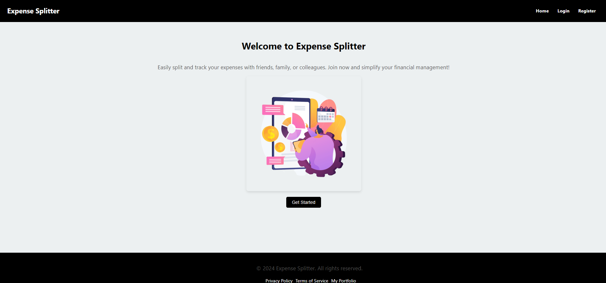
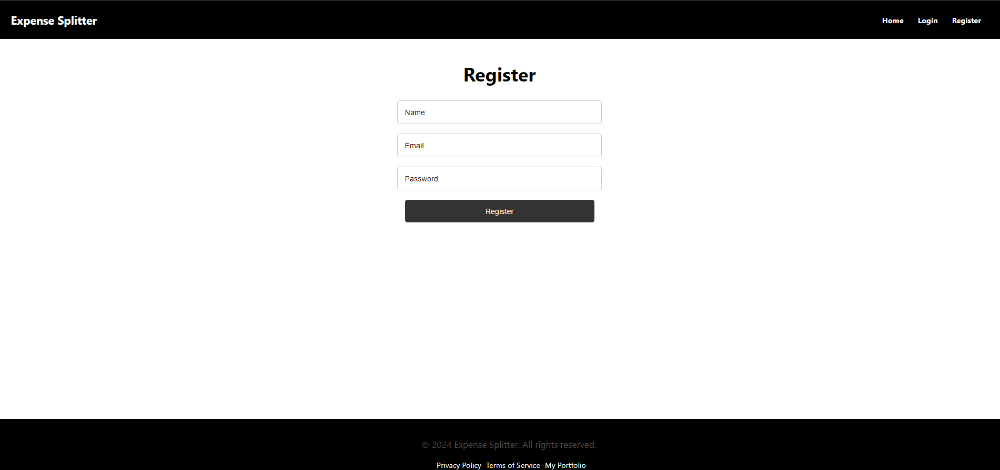
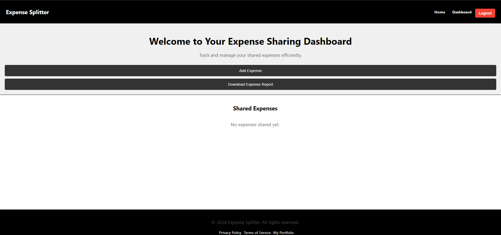
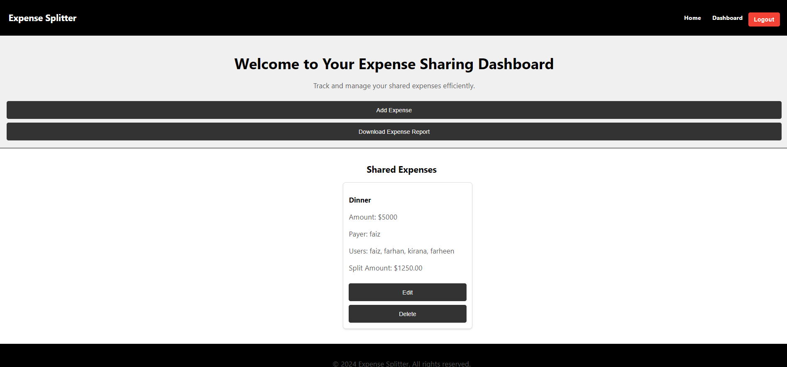

# Task 5: Expense Sharing App

## Overview
The Expense Sharing App is a frontend application designed to help users split and track shared expenses within a group. Users can create groups, add transactions, and divide expenses for trips or events.

## Features
- Create and manage groups for expense sharing.
- Add transactions and split expenses among group members.
- View a summary of expenses and balances for each group.
- Supports various types of expenses like food, travel, and utilities.

## Screenshots

### Home Page

### register Page

### Group Page

### Transaction Form

## Technologies Used
- **React** (Frontend)
- **CSS** for styling
- **React Router** for navigation
- **Context API** for state management

## Installation and Setup
1. Clone the repository.
2. Run `npm install` to install frontend dependencies.
3. Start the app with `npm start`.

## How to Use
1. Register or log in (if login functionality exists).
2. Create a new group for a trip or event.
3. Add expenses to the group and specify how much each member owes.
4. View the breakdown of who owes whom and settle the balances.

## Files
- `GroupPage.js`: Manages group creation and transaction details.
- `CreateGroupModals.js`: Handles adding and splitting expenses.
- `Dashboard.js`: Displays summary and balances for each group.

## Future Improvements
- Add backend integration to store data persistently.
- Implement payment integration to settle balances within the app.
- Implement notifications for users when new expenses are added.
